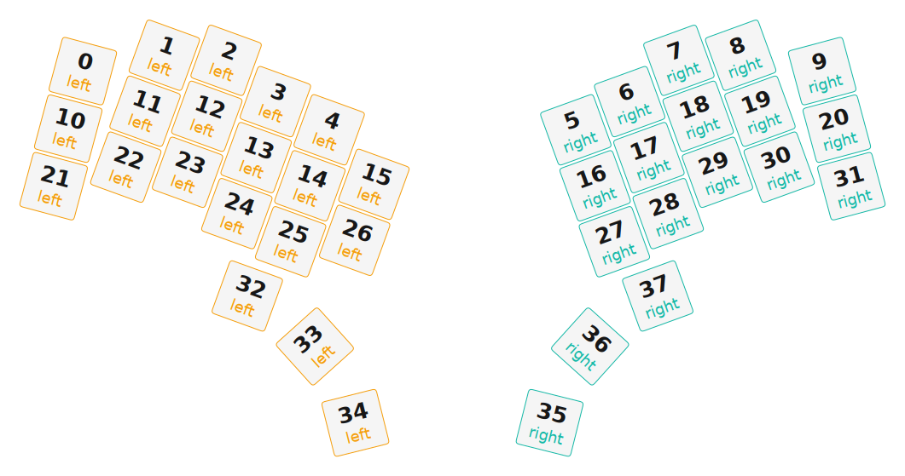

# ZMK Configuration for Iteration

*Generated by Shield Wizard for ZMK*



Download compiled firmware from the Actions tab. <https://zmk.dev/docs/user-setup#installing-the-firmware>

Edit your keymap <https://zmk.dev/docs/keymaps>.
User keymap is located at [`config/iteration.keymap`](config/iteration.keymap).

-----

<details>
<summary>
Shield Wizard Debug Information
</summary>

In case of broken configuration, here is the Shield Wizard internal data used to generate this configuration:

Commit: 8a52249f61161469b6d90ed8c80c4aa52b9f3858

```json
{"name":"Iteration","shield":"iteration","dongle":false,"modules":[],"layout":[{"id":"01KJ42AEC525VMJ13RFCVKKA7G","part":0,"row":0,"col":0,"w":1,"h":1,"x":0.601,"y":0.408,"r":15,"rx":1.101,"ry":0.908},{"id":"01KJ42AEC54216WGH29J8SVYT2","part":0,"row":0,"col":1,"w":1,"h":1,"x":1.967,"y":0.141,"r":20,"rx":2.467,"ry":0.641},{"id":"01KJ42AEC5WYPC2MFRRWMA6BWQ","part":0,"row":0,"col":2,"w":1,"h":1,"x":3.002,"y":0.227,"r":20,"rx":3.502,"ry":0.727},{"id":"01KJ42AEC5B5Y8JBP0JPQ8DVVG","part":0,"row":0,"col":3,"w":1,"h":1,"x":3.828,"y":0.92,"r":20,"rx":4.328,"ry":1.42},{"id":"01KJ42AEC53G6QH27JC0XVQE72","part":0,"row":0,"col":4,"w":1,"h":1,"x":4.729,"y":1.393,"r":20,"rx":5.229,"ry":1.893},{"id":"01KJ42AEC54SRTGD3P13J60ZBC","part":1,"row":0,"col":12,"w":1,"h":1,"x":8.862,"y":1.393,"r":-20,"rx":9.362,"ry":1.893},{"id":"01KJ42AEC5B67SDGWP63TABHHG","part":1,"row":0,"col":13,"w":1,"h":1,"x":9.764,"y":0.92,"r":-20,"rx":10.264,"ry":1.42},{"id":"01KJ42AEC5KZZZGX6A2SV1AKHE","part":1,"row":0,"col":14,"w":1,"h":1,"x":10.589,"y":0.227,"r":-20,"rx":11.089,"ry":0.727},{"id":"01KJ42AEC5X9EVEFA48VNDN72P","part":1,"row":0,"col":15,"w":1,"h":1,"x":11.624,"y":0.141,"r":-20,"rx":12.124,"ry":0.641},{"id":"01KJ42AEC56H4DEJP0HG009CBD","part":1,"row":0,"col":16,"w":1,"h":1,"x":12.99,"y":0.408,"r":-15,"rx":13.49,"ry":0.908},{"id":"01KJ42AEC5JKK0N2BKC8FHT4YY","part":0,"row":1,"col":0,"w":1,"h":1,"x":0.357,"y":1.374,"r":15,"rx":0.857,"ry":1.874},{"id":"01KJ42AEC5F9MTV8Y79SE529MS","part":0,"row":1,"col":1,"w":1,"h":1,"x":1.644,"y":1.081,"r":20,"rx":2.144,"ry":1.581},{"id":"01KJ42AEC5N85VYC2F6W8DT9VT","part":0,"row":1,"col":2,"w":1,"h":1,"x":2.679,"y":1.166,"r":20,"rx":3.179,"ry":1.666},{"id":"01KJ42AEC5MGM95MTQ4FS7EEAK","part":0,"row":1,"col":3,"w":1,"h":1,"x":3.505,"y":1.86,"r":20,"rx":4.005,"ry":2.36},{"id":"01KJ42AEC59FCXJE2VTESZYMQ0","part":0,"row":1,"col":4,"w":1,"h":1,"x":4.406,"y":2.333,"r":20,"rx":4.906,"ry":2.833},{"id":"01KJ42AEC6VXNJRYWEDNKCVKYT","part":0,"row":1,"col":5,"w":1,"h":1,"x":5.479,"y":2.308,"r":20,"rx":5.979,"ry":2.808},{"id":"01KJ42AEC6N8EWEBS0KMS0JPRV","part":1,"row":1,"col":12,"w":1,"h":1,"x":9.185,"y":2.333,"r":-20,"rx":9.685,"ry":2.833},{"id":"01KJ42AEC6GXV01B2Q58Y51SC7","part":1,"row":1,"col":13,"w":1,"h":1,"x":10.087,"y":1.86,"r":-20,"rx":10.587,"ry":2.36},{"id":"01KJ42AEC6X2G32EB74MZ1N19X","part":1,"row":1,"col":14,"w":1,"h":1,"x":10.912,"y":1.166,"r":-20,"rx":11.412,"ry":1.666},{"id":"01KJ42AEC6W326KHYJWYN49BQM","part":1,"row":1,"col":15,"w":1,"h":1,"x":11.947,"y":1.081,"r":-20,"rx":12.447,"ry":1.581},{"id":"01KJ42AEC65QE1N1T4EVQDP7W3","part":1,"row":1,"col":16,"w":1,"h":1,"x":13.235,"y":1.374,"r":-15,"rx":13.735,"ry":1.874},{"id":"01KJ42AEC6APMXZCH32FWD3X9M","part":0,"row":2,"col":0,"w":1,"h":1,"x":0.112,"y":2.34,"r":15,"rx":0.612,"ry":2.84},{"id":"01KJ42AEC6E3X8JANQ03PCPHZ2","part":0,"row":2,"col":1,"w":1,"h":1,"x":1.321,"y":2.02,"r":20,"rx":1.821,"ry":2.52},{"id":"01KJ42AEC6R7GH99AY9AYHMK6R","part":0,"row":2,"col":2,"w":1,"h":1,"x":2.356,"y":2.106,"r":20,"rx":2.856,"ry":2.606},{"id":"01KJ42AEC6MPXHF4F4N0NRDS6X","part":0,"row":2,"col":3,"w":1,"h":1,"x":3.182,"y":2.8,"r":20,"rx":3.682,"ry":3.3},{"id":"01KJ42AEC6JR1S410X4QXR7D5W","part":0,"row":2,"col":4,"w":1,"h":1,"x":4.083,"y":3.272,"r":20,"rx":4.583,"ry":3.772},{"id":"01KJ42AEC6Q7JSMSJM4ME6GCN9","part":0,"row":2,"col":5,"w":1,"h":1,"x":5.156,"y":3.248,"r":20,"rx":5.656,"ry":3.748},{"id":"01KJ42AEC6DTRVF4M2DK8PZWW1","part":1,"row":2,"col":12,"w":1,"h":1,"x":9.508,"y":3.272,"r":-20,"rx":10.008,"ry":3.772},{"id":"01KJ42AEC6Q1F9X75B3VJ0XC25","part":1,"row":2,"col":13,"w":1,"h":1,"x":10.41,"y":2.8,"r":-20,"rx":10.91,"ry":3.3},{"id":"01KJ42AEC67XMHMTM6GTNA8198","part":1,"row":2,"col":14,"w":1,"h":1,"x":11.235,"y":2.106,"r":-20,"rx":11.735,"ry":2.606},{"id":"01KJ42AEC65P4YRQZCRGB8VZFG","part":1,"row":2,"col":15,"w":1,"h":1,"x":12.27,"y":2.02,"r":-20,"rx":12.77,"ry":2.52},{"id":"01KJ42AEC686662JRDWBG99ZQV","part":1,"row":2,"col":16,"w":1,"h":1,"x":13.479,"y":2.34,"r":-15,"rx":13.979,"ry":2.84},{"id":"01KJ42AEC6EBZWR60MSRA7NMFA","part":0,"row":3,"col":6,"w":1,"h":1,"x":3.357,"y":4.182,"r":20,"rx":3.857,"ry":4.682},{"id":"01KJ42AEC6K9Q7RH7RR40780Y4","part":0,"row":3,"col":7,"w":1,"h":1,"x":4.49,"y":5.03,"r":-42,"rx":4.99,"ry":5.53},{"id":"01KJ42AEC67YGCK2PYXPFJJ5G5","part":0,"row":3,"col":8,"w":1,"h":1,"x":5.168,"y":6.312,"r":-14,"rx":5.668,"ry":6.812},{"id":"01KJ42AEC61CPMZ339PHQX5X16","part":1,"row":3,"col":9,"w":1,"h":1,"x":8.423,"y":6.312,"r":14,"rx":8.923,"ry":6.812},{"id":"01KJ42AEC6G9RSPDG08RYB3J1V","part":1,"row":3,"col":10,"w":1,"h":1,"x":9.101,"y":5.03,"r":42,"rx":9.601,"ry":5.53},{"id":"01KJ42AEC6VKEYX3R9JZP8XEWF","part":1,"row":3,"col":11,"w":1,"h":1,"x":10.235,"y":4.182,"r":-20,"rx":10.735,"ry":4.682}],"parts":[{"name":"left","controller":"nice_nano_v2","wiring":"matrix_diode","pins":{"d14":"output","d15":"output","d18":"output","d16":"output","d9":"output","d8":"output","d7":"output","d6":"output","d5":"output","d2":"input","d3":"input","d4":"input","d10":"input"},"keys":{"01KJ42AEC525VMJ13RFCVKKA7G":{"input":"d2","output":"d18"},"01KJ42AEC54216WGH29J8SVYT2":{"input":"d2","output":"d9"},"01KJ42AEC5WYPC2MFRRWMA6BWQ":{"input":"d2","output":"d8"},"01KJ42AEC5B5Y8JBP0JPQ8DVVG":{"input":"d2","output":"d7"},"01KJ42AEC53G6QH27JC0XVQE72":{"input":"d2","output":"d6"},"01KJ42AEC5JKK0N2BKC8FHT4YY":{"input":"d3","output":"d18"},"01KJ42AEC5F9MTV8Y79SE529MS":{"input":"d3","output":"d9"},"01KJ42AEC5N85VYC2F6W8DT9VT":{"input":"d3","output":"d8"},"01KJ42AEC5MGM95MTQ4FS7EEAK":{"input":"d3","output":"d7"},"01KJ42AEC59FCXJE2VTESZYMQ0":{"input":"d3","output":"d6"},"01KJ42AEC6VXNJRYWEDNKCVKYT":{"input":"d3","output":"d5"},"01KJ42AEC6APMXZCH32FWD3X9M":{"input":"d4","output":"d18"},"01KJ42AEC6E3X8JANQ03PCPHZ2":{"input":"d4","output":"d9"},"01KJ42AEC6R7GH99AY9AYHMK6R":{"input":"d4","output":"d8"},"01KJ42AEC6MPXHF4F4N0NRDS6X":{"input":"d4","output":"d7"},"01KJ42AEC6JR1S410X4QXR7D5W":{"input":"d4","output":"d6"},"01KJ42AEC6Q7JSMSJM4ME6GCN9":{"input":"d4","output":"d5"},"01KJ42AEC6K9Q7RH7RR40780Y4":{"input":"d10","output":"d15"},"01KJ42AEC67YGCK2PYXPFJJ5G5":{"input":"d10","output":"d14"},"01KJ42AEC6EBZWR60MSRA7NMFA":{"input":"d10","output":"d16"}},"encoders":[],"buses":[{"name":"spi0","devices":[],"type":"spi"},{"name":"spi1","devices":[],"type":"spi"},{"name":"spi2","devices":[],"type":"spi"},{"name":"spi3","devices":[],"type":"spi"},{"name":"i2c0","devices":[],"type":"i2c"},{"name":"i2c1","devices":[],"type":"i2c"}]},{"name":"right","controller":"nice_nano_v2","wiring":"matrix_diode","pins":{"d2":"bus","d3":"bus","d1":"bus","d4":"input","d20":"input","d19":"input","d10":"output","d16":"output","d14":"output","d15":"output","d18":"output","d5":"output","d6":"output","d7":"output","d21":"input"},"keys":{"01KJ42AEC61CPMZ339PHQX5X16":{"input":"d4","output":"d5"},"01KJ42AEC6G9RSPDG08RYB3J1V":{"input":"d4","output":"d6"},"01KJ42AEC6VKEYX3R9JZP8XEWF":{"input":"d4","output":"d7"},"01KJ42AEC686662JRDWBG99ZQV":{"input":"d19","output":"d10"},"01KJ42AEC65P4YRQZCRGB8VZFG":{"input":"d19","output":"d16"},"01KJ42AEC67XMHMTM6GTNA8198":{"input":"d19","output":"d14"},"01KJ42AEC6Q1F9X75B3VJ0XC25":{"input":"d19","output":"d15"},"01KJ42AEC6DTRVF4M2DK8PZWW1":{"input":"d19","output":"d18"},"01KJ42AEC65QE1N1T4EVQDP7W3":{"input":"d20","output":"d10"},"01KJ42AEC6GXV01B2Q58Y51SC7":{"input":"d20","output":"d15"},"01KJ42AEC6N8EWEBS0KMS0JPRV":{"input":"d20","output":"d18"},"01KJ42AEC6W326KHYJWYN49BQM":{"input":"d20","output":"d16"},"01KJ42AEC6X2G32EB74MZ1N19X":{"input":"d20","output":"d14"},"01KJ42AEC56H4DEJP0HG009CBD":{"input":"d21","output":"d10"},"01KJ42AEC5X9EVEFA48VNDN72P":{"input":"d21","output":"d16"},"01KJ42AEC5KZZZGX6A2SV1AKHE":{"input":"d21","output":"d14"},"01KJ42AEC5B67SDGWP63TABHHG":{"input":"d21","output":"d15"},"01KJ42AEC54SRTGD3P13J60ZBC":{"input":"d21","output":"d18"}},"encoders":[],"buses":[{"name":"spi0","devices":[{"type":"niceview","cs":"d1"}],"type":"spi","mosi":"d2","sck":"d3"},{"name":"spi1","devices":[],"type":"spi"},{"name":"spi2","devices":[],"type":"spi"},{"name":"spi3","devices":[],"type":"spi"},{"name":"i2c0","devices":[],"type":"i2c"},{"name":"i2c1","devices":[],"type":"i2c"}]}]}
```

</details>
